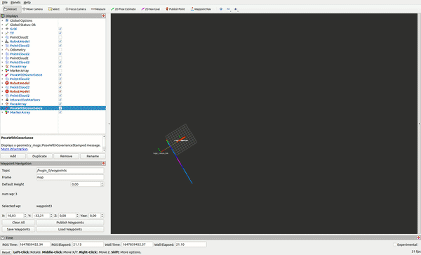
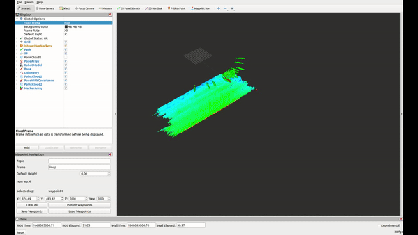

# AUV Exploration

Collection of ROS packages for localization, map building and SLAM with autonomous underwater vehicles and sonar sensors.

## Dependencies (tested on Ubuntu 20.04)
* ROS Noetic
* AUVLIB [here](https://github.com/nilsbore/auvlib) And set the same cmake flags required for Ubuntu 18.
* Bathymetric SLAM [here](https://github.com/ignaciotb/bathymetric_slam)
* GTSAM [here](https://github.com/borglab/gtsam)

```
sudo apt install python3-pygame python3-scipy python3-configargparse python3-numpy
pip install configargparse pygame 
```
Make sure your scipy version is >= 1.4.0

If you're going to be working with Gaussian Processes maps, also install
* Pytorch [here](https://pytorch.org/)
```
pip install gpytorch open3d 
```
If you want to try waypoint navigation for an AUV, clone this repo within your catkin workspace to plan missions in RVIZ
* Waypoint_navigation_plugin [here](https://github.com/KumarRobotics/waypoint_navigation_plugin)

## Building
This is a collection of ROS packages. Just clone the repo within your catking workspace and run
```
rosdep install --from-paths catkin_ws --ignore-src --rosdistro=$ROS_DISTRO -y
catkin_make -DCMAKE_BUILD_TYPE=Release install
```
## Troubleshooting
If you experience errors with GTSAM libraries not being found, add this line at the end of your .bashrc

    export LD_LIBRARY_PATH=$LD_LIBRARY_PATH:/usr/local/lib

## Paper introducing the framework
[Paper](https://arxiv.org/abs/2203.10893)
If you find the repo and the methods useful, please cite us.
```
@article{torroba2022fully,
  title={Fully-Probabilistic Terrain Modelling and Localization With Stochastic Variational Gaussian Process Maps},
  author={Torroba, Ignacio and Sprague, Christopher Iliffe and Folkesson, John},
  journal={IEEE Robotics and Automation Letters},
  year={2022},
  publisher={IEEE}
}
```

## Demos
We provide a dataset collected with a hull-mounted MBES on a ship for example demos. However the code will need to be tuned for applications in different setups (bathymetry, sensors, vehicle and so on).

### Basic demo with one AUV
Reproduce a real bathymetric survey (gt):


```
roslaunch auv_model auv_environment.launch namespace:=hugin_0 mode:=gt start_mission_ping_num:=0
roslaunch auv_model auv_env_aux.launch
```
You should see in RVIZ the AUV and the MBES pings.

Simulate a bathymetric survey (sim):


```
roslaunch auv_model auv_environment.launch namespace:=hugin_0 mode:=sim
roslaunch auv_model auv_env_aux.launch
roslaunch basic_navigation basic_mission.launch manual_control:=True namespace:=hugin_0
```
The last command provides an interface to run the AUV manually with the keyboard (w=forward, s=backward a,d=+/-yaw, up,down=+/-pitch)

### Waypoint navigation with one AUV
Alternatively, to plan and execute autonomous waypoint navigation missions in simulation, install [this package](https://github.com/KumarRobotics/waypoint_navigation_plugin).



```
roslaunch basic_navigation basic_mission.launch manual_control:=False namespace:=hugin_0
```
And add and publish waypoints through RVIZ as in their tutorial.

### Manual navigation with multiple AUVs
Example of multi-agent mission with 2 AUVs:
```
roslaunch auv_model auv_environment.launch namespace:=hugin_0
roslaunch auv_model auv_model.launch namespace:=hugin_1 y:=10
roslaunch auv_model auv_env_aux.launch
roslaunch basic_navigation basic_mission.launch manual_control:=True namespace:=hugin_0
roslaunch basic_navigation basic_mission.launch manual_control:=True namespace:=hugin_1
```
*WP navigation isn't implemented yet for several AUVs and currently you'll need a manual controller per AUV, although this is easy to modify in the launch if required.

### Particle filter localization with an AUV
Replay the AUV bathymetric survey with a PF running on a mesh or a Gaussian process created from the bathymetry.
Set "gp_meas_model==True" for the GP map, otherwise the PF measurement model will be based on raytracing over the mesh.

Note that you'll have to tune the filter parameters in 'auv_pf.launch' for your own application. The terrain provided in this demo is very challenging for localization.


```
roslaunch auv_particle_filter auv_pf.launch namespace:=hugin_0 mode:=gt start_mission_ping_num:=0
roslaunch auv_model auv_env_aux.launch
```

### Simulate particle filter localization with two AUVs
Check 'auv_pf.launch' for the main filter parameters
```
roslaunch auv_particle_filter auv_pf.launch namespace:=hugin_0 x:=-300 y:=-400
roslaunch auv_particle_filter auv_pf.launch namespace:=hugin_1 x:=-330 y:=-430
roslaunch auv_model auv_env_aux.launch
roslaunch basic_navigation basic_mission.launch manual_control:=True namespace:=hugin_0
roslaunch basic_navigation basic_mission.launch manual_control:=True namespace:=hugin_1

```

### Vehicle uncertainty propagation to the MBES beams
In order to create a dataset with propagated and fused AUV DR uncertainty + MBES noise into the sensor data, run:
```
roslaunch auv_model auv_env_aux.launch
roslaunch uncert_management ui_test.launch mode:=gt namespace:=hugin_0
```
Set the parameters start_mission_ping_num and end_mission_ping_num to adjust the lenght of the survey to be replayed. Once the end ping is reached, the system will save "ripples_svgp_input.npz" under the "~/.ros" folder. This file contains the MBES beams and their associated uncertainties, and can be used to train a SVGP map of the area.

Uncertainty propagation through sigma points can be a heavy process, so make sure you set the reply_rate such that all MBES beams can be processed on time, otherwise data will be lost.


### Stochastic Variational Gaussian Process maps
To train a SVGP to regress the bathymetry collected and build a map with DIs or UIs, run the following command with the desired type:
```
/gp_map_training.py --survey_name ~/.ros/ripples_svgp_input.npz --gp_inputs di
```


Note this is not a ROS node. This script is based on the GPytorch implementation of SVGP, take a look at their tutorials to understand and tune the parameters. After the training, it will save the trained SVGP, a point cloud sampled from the SVGP posterior for visualization in RVIZ and some images. The output SVGP map (.pth) can be directly used for the PF-GP implementation above pointing the auv_pf.launch to it.

### RBPF SLAM with SVGP maps
To run the RBPF SLAM framework: 
```
roslaunch auv_model auv_environment.launch namespace:=hugin_0 mode:=gt
roslaunch auv_model auv_env_aux.launch mode:=gt
roslaunch rbpf_slam rbpf_slam.launch namespace:=hugin_0 particle_count:=20 num_particle_handlers:=4 results_path:=/path/to/save/results
```
Once the RBPF terminal is ready, use the Waypoints in rviz to cage the area to map (use at least 4, the order doesn't matter) and publish them. If you're running a sim mission, the mission plan waypoints will suffice for this. You should see something like this.



The RBPF will stop and save the SVGP maps when the last ping has been replayed (see param end_mission_ping_num). You can also stop it calling 
```
rostopic pub /gt/survey_finished std_msgs/Bool "data: false"
```
In order to plot a SVGP map offline, call 
```
./plot_svgp.py /path/to/save/results 0
```
Where 0 is the number of the SVGP map you want to plot. Adjust the number of inducing points in this script to that used in the RBPF.
The results will look like these (for 3 random particles)


**Important**: this is a very computationally heavy algorithm, tune it with care or your PC will run out of resources quickly. The params "particle_count" and "num_particle_handlers" will have a direct impact on the memory and GPU usage, so careful when instantiating them. The same applies to the SVGP parameters "svgp_num_ind_points" and "svgp_minibatch_size" and how often the filter prompts a loop closure detection "rbpf_period".

### Submap graph SLAM
Currently porting [Bathymetric SLAM](https://github.com/ignaciotb/bathymetric_slam) into this framework.
